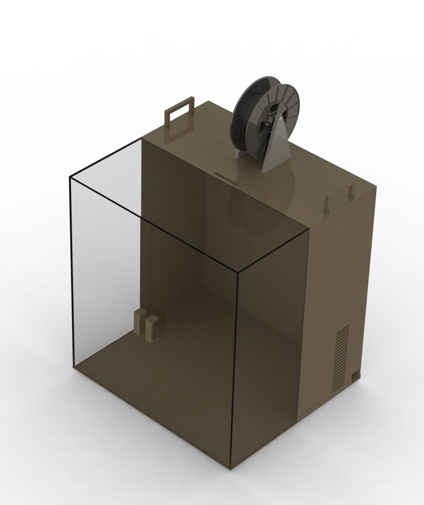

# Case para Impressora 3D

Projeto criado para a utilização na impressora Graber.
.jpeg)

### Sobre o suporte do rolo de filamento
Para fazer o esboço do suporte, usou-se o rolo de filamento com as seguintes especificações:
- Material do Filamento: ABS;
- Peso total: 1KG;
- Diâmetro do Carretel: 200 mm; 
- Diâmetro do furo do carretel: 52 mm; 
- Largura do Carretel: 76 mm; 
- Diâmetro do Filamento: 1,75 mm; 
- Temperaturas: Plataforma: 110°C (230°F); Bico: 220°C (428°F); 
- Densidade: 1,04g/cm3; 
- Comprimento: 400m;

Pode-se usar qualquer tipo de suporte, desde que tenha os seguintes requisitos (de acordo com o rolo de filamento analisado):
- Altura mínima: 150mm;
- Comprimento: 100mm;
- Largura da base: 10mm;
- Distância mínima entre as bases: 80mm;

### Esboço final no SolidWorks

